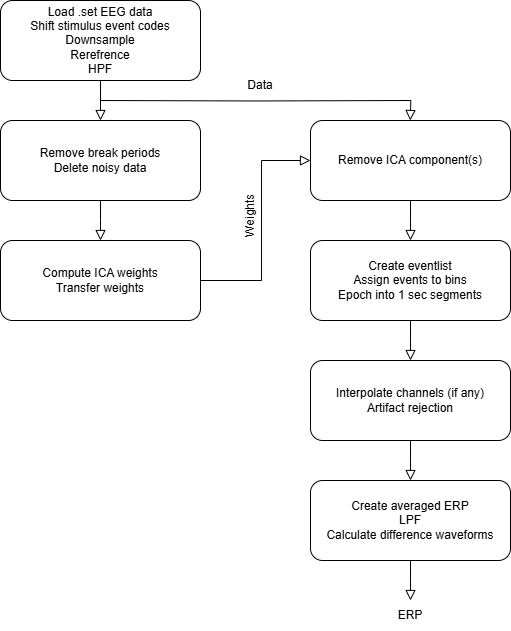

# Visual_N170_Preprocessing

## ERP
Event Related Potential(ERPs) are primarily generated in cortical pyramidal cells, where extracellular voltages produced by thousands of neurons sum together and are conducted instantaneously to the scalp. ERPs therefore provide a direct measure of neural activity with the millisecond-level temporal resolution necessary to isolate the neurocognitive operations that rapidly unfold following a stimulus, response, or other event.

## About ERP Core -
The ERP CORE—a Compendium of Open Resources and Experiments for human ERP research—consists of optimized paradigms, experiment control scripts, EEG data, analysis pipelines, data processing scripts, and a broad set of results for seven widely used ERP components: 
- N170
- mismatch negativity (MMN)
- N2pc
- N400
- P3
- lateralized readiness potential (LRP)
- error related negativity (ERN).
All materials are freely available at [ERP Core](https://doi.org/10.18115/D5JW4R).
The data for the experiment was taken from ERP CORE website [2]. The details of the N170 Visual Perception task is as folllows - 

### Participants
The ERP Core dataset tested 40 participants (25 female, 15 male) however, a subset of 30 participants (1:30) were taken from the original 40 participant source in ERP Core due to hardware restrictions. 
### EEG Recording 
Recordings in the original ERP Core experiment were taken from 30 scalp electrodes placed according to the International 10/20 System (FP1, F3, F7, FC3, C3, C5, P3, P7, P9, PO7, PO3, O1, Oz, Pz, CPz, FP2, Fz, F4, F8, FC4, FCz, Cz, C4, C6, P4, P8, P10, PO8, PO4, O2). All signals were low-pass filtered using a fifth order sinc filter with a half-power cutoff at 204.8 Hz and then digitized at 1024 Hz with 24 bits of resolution. 
### Amplitude and Latency Measures
To measure amplitude and latency of parent / difference waves, the following measures were calculated
- 50% area latency - explain 
- Onset latency
- Peak latency
- Mean amplitude
- Peak amplitude

## Visual Perception and the N170 - 
In this task, an image of a face, car, scrambled face, or scrambled car was presented on each trial in the center of the screen, and participants responded whether the stimulus was an “object” (face or car) or a “texture” (scrambled face or scrambled car). 

## Objective - 
In the analysis of electrophysiological data signal-to-noise ratio has to be improved by all adequate means. Priority should be given to the collection of higher numbers of trials and reduction of noise in data recording. However, in most situations filtering will nevertheless be necessary to appropriately analyze electrophysiological data. In these situations it is essential to know and understand the effects of filtering on the data and cautiously adjust filter settings (cutoff frequencies, roll-off, attenuation, and ripple) to the signal of interest and the particular application, e.g., by evaluating the effects of different filters on the data. Especially the high-pass filtering of slow ERP components or blinks, as commonly observed in the literature, might seriously affect ERP time course and amplitudes. [1]

## Procedure - 

## Results 

key electrode sites of interest (P7, P8, PO7, PO8, O1, O2) 

## Conclusion - 

## Additional - scripts used for the project

## References - 
[1] Widmann, Andreas, and Erich Schröger. "Filter effects and filter artifacts in the analysis of electrophysiological data." Frontiers in psychology 3 (2012): 233.
[2] Kappenman, Emily S., et al. "ERP CORE: An open resource for human event-related potential research." NeuroImage 225 (2021): 117465.
